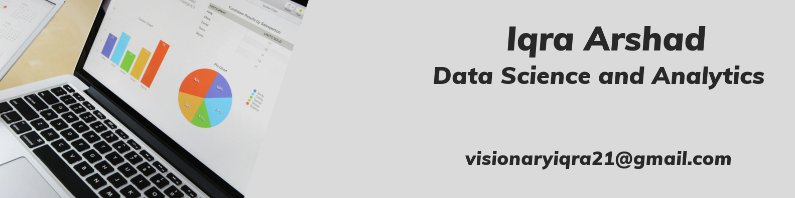

<h1 align="center">Hi 👋, I'm Iqra Arshad</h1>
<h3 align="center">A passionate Data Scientist and AI Enthusiast</h3>

  

  
  
  

---

### 🌟 About Me

- 🎓 **I'm a Data Scientist** with a keen interest in **Machine Learning**, **Deep Learning**, and **Data Visualization**.
- 💻 Currently working on **AI for Social Good** projects and exploring **NLP**.
- 🌱 Actively learning **MLOps** and **Cloud Computing** for large-scale AI deployment.
- 🛠️ Experienced in building **data-driven solutions** to solve real-world challenges.

---

### 💡 Skills & Tools

- **Programming Languages:** Python, R, SQL
- **Data Science Tools:** Pandas, NumPy, Scikit-learn, TensorFlow, Power BI
- **Visualization Tools:** Matplotlib, Seaborn, Plotly
- **Cloud Platforms:** AWS, Google Cloud Platform
- **Other:** Git, Docker, Jupyter Notebook

---

## 🤝 Collaboration
- Open to collaborating on interesting data science projects, especially in the fields of machine learning, natural language processing, or AI for social good.

---

### 🤝 Let's Connect

  
  

---

### 🌟 Fun Fact

💡 I believe **data can tell stories** better than words, and I strive to make those stories impactful through my work!

---

